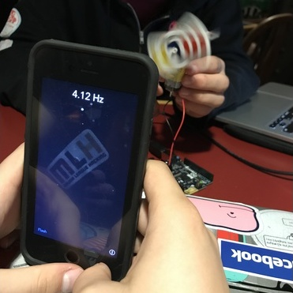

# Strobr
> Camera-based stroboscope app

Strobr is a camera-based stroboscope app that relies on continuously variable frame rates to measure the frequencies of cycles. A traditional stroboscope flashes bright lights at a specific frequency that can be easily matched to the rotational frequency of i.e. a car wheel using persistence of vision (POV), allowing the rotational speed to be measured. Strobr works similarly, but can also measure many things like electrical light frequencies and very low slow rotations that a traditional stroboscope cannot. It’s also more convenient and much less distracting to others! This app was built at PennApps 2017 and won top 30 there. You can read more about the process of making it on [Devpost](https://devpost.com/software/strobr-vyomna).

Strobr is available for free on the iOS [App Store](https://itunes.apple.com/us/app/strobr-scope/id1330331187). You can also sideload this app yourself, by opening it in XCode, changing the bundle id, and signing with your own team. For more information see this [guide](http://bouk.co/blog/sideload-iphone/).
